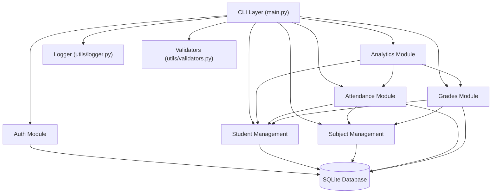
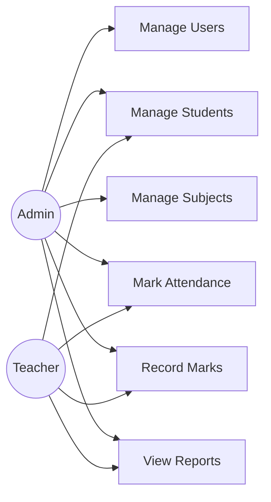
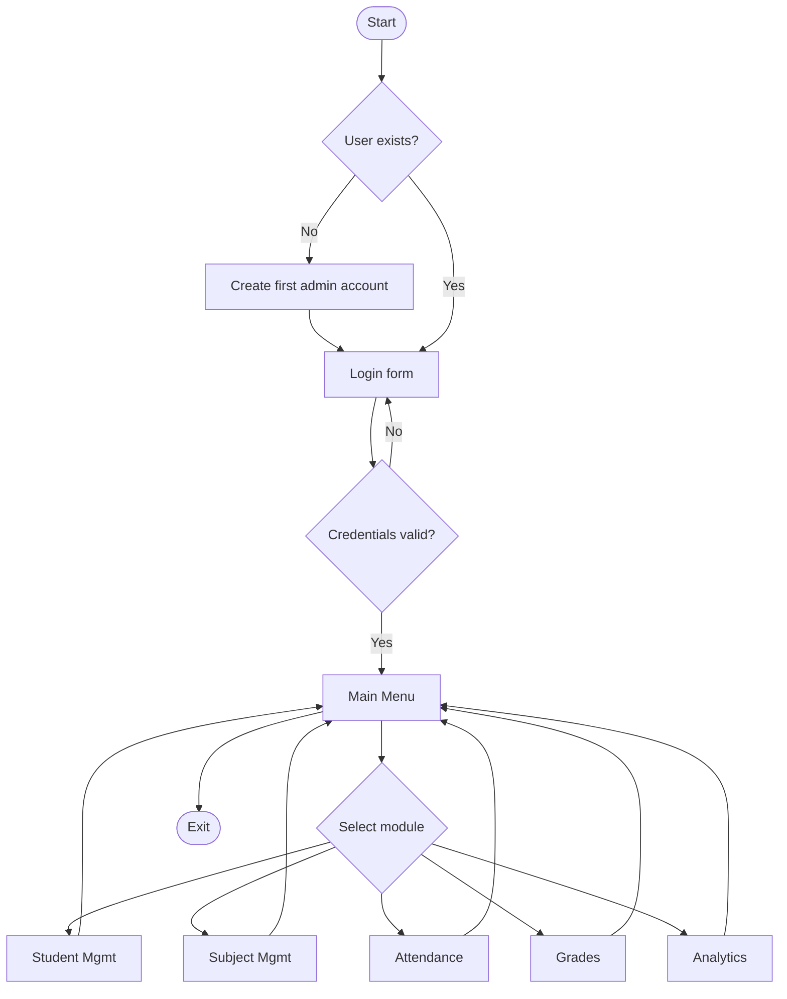
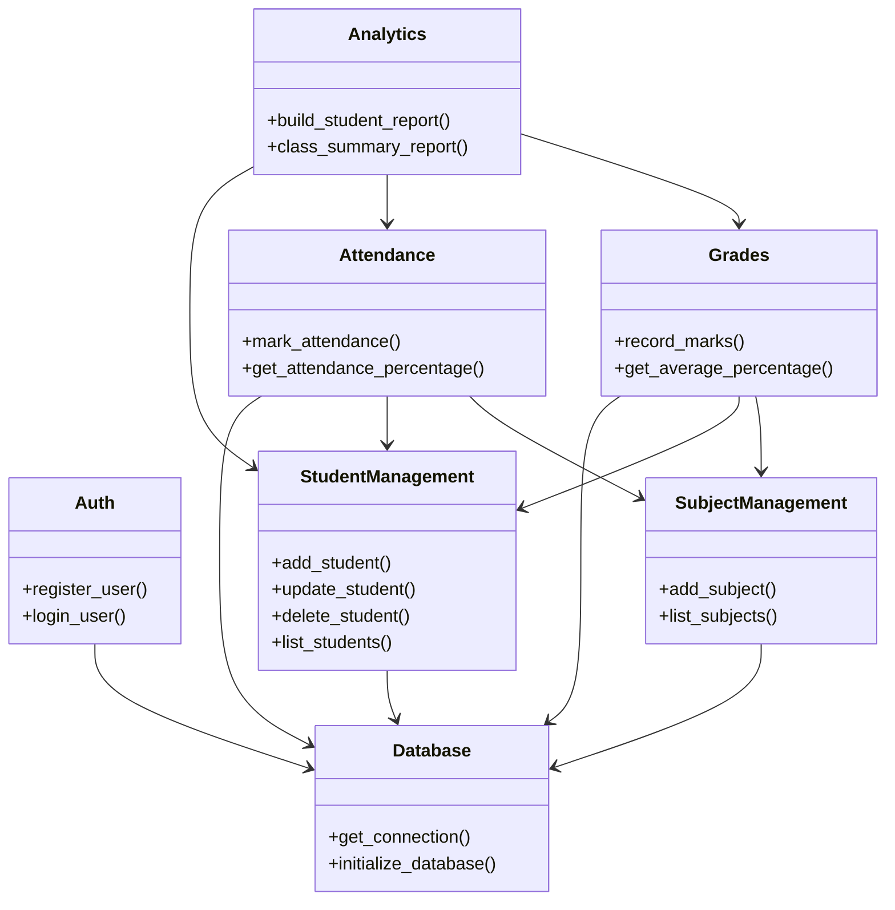
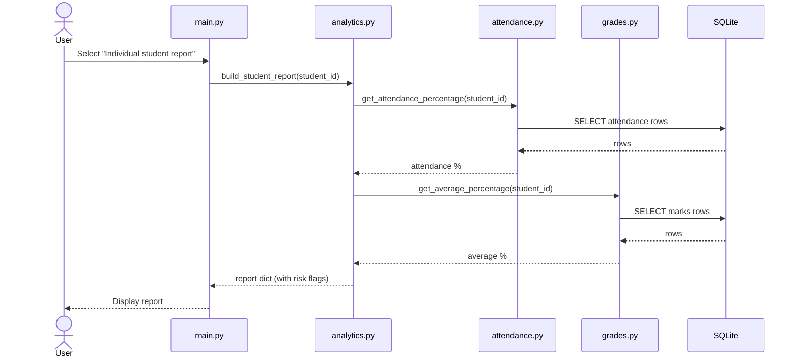

# Design Documentation

These diagrams are written in Mermaid syntax. You can render them by
pasting into https://mermaid.live, or GitHub renders Mermaid code
blocks natively in Markdown files — use these as a starting point for
your project report; redraw/relabel them in your own words rather
than copy-pasting verbatim.

## 1. System Architecture



## 2. Use Case Diagram



## 3. Process / Workflow Diagram



## 4. Class / Component Diagram



## 5. Sequence Diagram — "Generate Individual Student Report"



## 6. ER Diagram

```mermaid
erDiagram
    USERS {
        int user_id PK
        string username
        string password_hash
        string role
    }
    STUDENTS {
        int student_id PK
        string roll_number
        string name
        string email
        int enrolled_year
    }
    SUBJECTS {
        int subject_id PK
        string subject_code
        string subject_name
        int max_marks
    }
    ATTENDANCE {
        int attendance_id PK
        int student_id FK
        int subject_id FK
        string date
        string status
    }
    MARKS {
        int mark_id PK
        int student_id FK
        int subject_id FK
        string assessment_name
        float marks_obtained
    }

    STUDENTS ||--o{ ATTENDANCE : has
    SUBJECTS ||--o{ ATTENDANCE : has
    STUDENTS ||--o{ MARKS : has
    SUBJECTS ||--o{ MARKS : has
